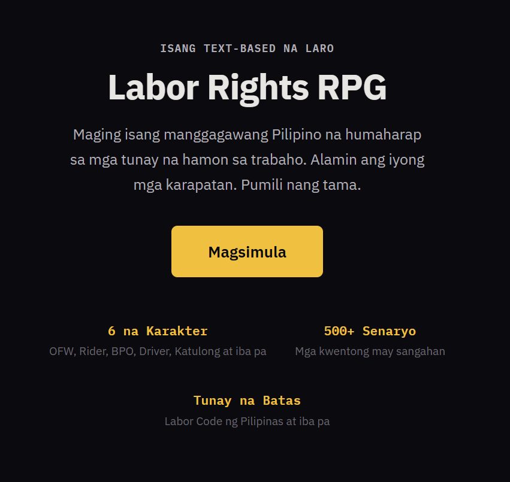

[](LICENSE)

# Labor Rights RPG

A text-based narrative RPG that teaches Filipino workers their labor rights through interactive storytelling. Players choose a character, face realistic workplace scenarios with RPG stat mechanics, and learn about Philippine labor laws — not through lectures, but through gameplay.

**Play now: [laborquest.app](https://laborquest.app)**



## Characters

| Character | Role | Story |
|---|---|---|
| Maria Santos | OFW (Domestic Helper) | First-time overseas worker heading to the Middle East, navigating recruitment scams and contract substitution |
| Jake Reyes | Delivery Rider | Gig worker in Metro Manila classified as "independent contractor" with no benefits |
| Angela Cruz | BPO Worker | Call center night-shift agent dealing with forced overtime and health issues |
| Roberto Dela Cruz | Construction Worker | Subcontracted worker in Cebu facing unsafe conditions and wage theft |
| Mang Ernesto Bautista | Family Driver | Private driver for 8 years with no written contract, SSS, or overtime pay |
| Aling Rosa Mendoza | Kasambahay | Live-in household helper working 5 AM to 10 PM with no rest day |

## Tech Stack

- **Frontend**: React 18 + Vite (PWA with offline support)
- **Backend**: Express.js (Helmet, CORS, rate limiting)
- **Content**: 412 pre-generated static JSON scenario nodes (zero runtime AI costs)
- **Content Generation**: Anthropic Claude API (one-time, via `scripts/generate.js`)
- **Deployment**: GCP Cloud Run + Firebase Hosting
- **Languages**: English and Tagalog (bilingual UI + scenarios)

## Local Development

```bash
# Clone and install
git clone https://github.com/Labor-Quest/labor-rights-rpg.git
cd labor-rights-rpg
npm install
cd client && npm install && cd ..
cd server && npm install && cd ..

# Run development servers (client :3000, server :8080)
npm run dev
```

## Content Generation

Scenario content is pre-generated using the Claude API and committed as static JSON. You only need to run this if adding or regenerating characters.

```bash
# Install script dependencies
cd scripts && npm install && cd ..

# Generate all characters
ANTHROPIC_API_KEY=sk-your-key node scripts/generate.js

# Generate a single character
ANTHROPIC_API_KEY=sk-your-key node scripts/generate.js --character ofw
```

Output goes to `data/scenarios/`. See [CONTRIBUTING.md](CONTRIBUTING.md) for details on the scenario JSON format.

## RPG Mechanics

- **Pera (Money)**: Philippine pesos that drain via monthly expenses. Debt locks legal action choices.
- **Lakas ng Loob (Confidence)**: Required to assert your rights. Low confidence adds doubt text.
- **Kalusugan (Wellbeing)**: Low values trigger health crises. Gates "refuse unsafe work" choices.
- **Choice Gating**: Bold choices require stats. "Give in" choices are never locked — exploitation is always accessible.
- **The mechanic IS the lesson**: "I know my rights but can't afford to use them."

## Partner With Us

Labor Rights RPG is a solo-developed social impact project aimed at educating Filipino workers about their legal protections. We're seeking partners in:

- **Government agencies** (DOLE, DepEd, DICT) for content validation and distribution
- **Impact investors and foundations** focused on worker empowerment
- **NGOs and labor organizations** for scenario review and outreach
- **Translators** for regional language support (Cebuano, Ilocano, etc.)

**Contact**: hello@laborquest.app

## License

[MIT](LICENSE) &copy; 2026 Labor Quest
